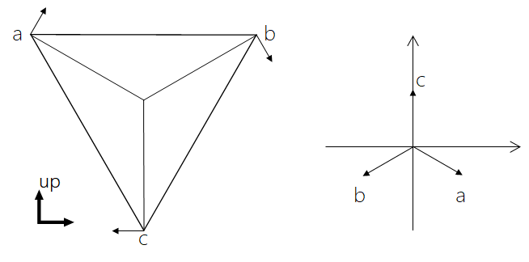

### 三轮全向轮运动学分析

- 定义三轮车的三个轮子分别是 A、B、C， 速度分别是a、b、c；

- 定义半径 Radius 是中点到轮子的距离；

- 定义 a，b 为前轮，c 为后轮。



三个速度平移到一点，三个速度大小分别是 a，b，c，分解到坐标系上的坐标应该是：
$$
\overrightarrow{V_a}=(\frac{\sqrt{3}}{2}a,-\frac{1}{2}a)\\\\
\overrightarrow{V_b}=(-\frac{\sqrt{3}}{2}b,-\frac{1}{2}b)\\\\
\overrightarrow{V_c}=(0,c)
$$
 以 y 方向为正方向，得到的和向量是：
$$
\overrightarrow{S}=(\frac{\sqrt{3}}{2}a-\frac{\sqrt{3}}{2}b,c-\frac{1}{2}a-\frac{1}{2}b)
$$
以车的旋转中心为车的中心，角速度的计算公式：
$$
\omega=\frac{a+b+c}{3r}
$$
总之，速度大小、速度方向、旋转角速度三个量决定了车体的运动和姿态。

#### 控制程序

思路：假设需要的速度是 $v,\omega$，以及需要偏向的角度是 $\theta$
$$
\begin{bmatrix}Vcos\theta\\\\ Vsin\theta\\\\ \omega\end{bmatrix}=\begin{bmatrix}V_x \\\\ V_y \\\\ \omega\end{bmatrix}=
\begin{bmatrix}
\frac{\sqrt{3}}{2} & -\frac{\sqrt{3}}{2} & 0\\\\
-\frac{1}{2} & -\frac{1}{2} & 1\\\\ 
\frac{1}{3r} & \frac{1}{3r} & \frac{1}{3r}
\end{bmatrix}
\begin{bmatrix}a\\\\ b \\\\ c \end{bmatrix}
$$
然后根据这个反解出 a，b，c 分给三个轮子，先对矩阵求逆：
$$
\begin{bmatrix}
\frac{\sqrt{3}}{2} & -\frac{\sqrt{3}}{2} & 0\\\\
-\frac{1}{2} & -\frac{1}{2} & 1\\\\ 
\frac{1}{3r} & \frac{1}{3r} & \frac{1}{3r}
\end{bmatrix}^{-1}=
\begin{bmatrix}
 \frac{\sqrt{3}}{3} & -\frac{1}{3} & r \\\\ 
-\frac{\sqrt{3}}{3} & -\frac{1}{3} &  r \\\\ 
0 & \frac{2}{3} & r
\end{bmatrix}
$$
带入左式：
$$
\begin{bmatrix}a\\\\ b \\\\ c \end{bmatrix}=
\begin{bmatrix}
 \frac{\sqrt{3}}{3} & -\frac{1}{3} & r \\\\ 
-\frac{\sqrt{3}}{3} & -\frac{1}{3} &  r \\\\ 
0 & \frac{2}{3} & r
\end{bmatrix}
\begin{bmatrix}Vcos\theta\\\\ Vsin\theta\\\\ \omega\end{bmatrix}
$$
python 实现：

```python
# demo
from math import sin,cos,pi,sqrt
Radius = 10 # 圆盘半径，需要根据情况修改
def compute(speed,angle,omega):
    radian = angle * pi / 180
    
    Vx = speed * cos(radian) # x 方向的速度
    Vy = speed * sin(radian) # y 方向的速度
    
    a =  sqrt(3)/3 * Vx - 1/3 * Vy + omega * Radius # a 轮的速度
    b = -sqrt(3)/3 * Vx - 1/3 * Vy + omega * Radius # b 轮的速度
    c =                   2/3 * Vy + omega * Radius # c 轮的速度
    
    return a,b,c
```


#### 电机控制程序

```python
import RPi.GPIO as GPIO
import time
import sys
from math import sin,cos,pi,sqrt

Radius = 10 # need to change

PWMA = 18
AIN1 = 22
AIN2 = 27

PWMB = 23
BIN1 = 25
BIN2 = 24

PWMC = 100 # need to change
CIN1 = 101 # need to change
CIN2 = 102 # need to change

GPIO.setwarnings(False) 
GPIO.setmode(GPIO.BCM)

GPIO.setup(AIN2,GPIO.OUT)
GPIO.setup(AIN1,GPIO.OUT)
GPIO.setup(PWMA,GPIO.OUT)

GPIO.setup(BIN1,GPIO.OUT)
GPIO.setup(BIN2,GPIO.OUT)
GPIO.setup(PWMB,GPIO.OUT)

GPIO.setup(CIN1,GPIO.OUT)
GPIO.setup(CIN2,GPIO.OUT)
GPIO.setup(PWMC,GPIO.OUT)

A_Motor= GPIO.PWM(PWMA,100)
A_Motor.start(0)

B_Motor = GPIO.PWM(PWMB,100)
B_Motor.start(0)

C_Motor = GPIO.PWM(PWMC,100)
C_Motor.start(0)

def compute(speed,angle,omega):
    radian = angle * pi / 180
    
    Vx = speed * cos(radian) # x velocity
    Vy = speed * sin(radian) # y velocity
    
    a =  sqrt(3)/3 * Vx - 1/3 * Vy + omega * Radius # a velocity
    b = -sqrt(3)/3 * Vx - 1/3 * Vy + omega * Radius # b velocity
    c =                   2/3 * Vy + omega * Radius # c velocity
       
    return a,b,c

def move(va,vb,vc,t_time = 3):
    A_Motor.ChangeDutyCycle(abs(va))
    GPIO.output(AIN1,bool(va>0))
    GPIO.output(AIN2,bool(va<0))

    B_Motor.ChangeDutyCycle(abs(vb))
    GPIO.output(BIN1,bool(vb>0))
    GPIO.output(BIN2,bool(vb<0))
    
    C_Motor.ChangeDutyCycle(abs(vc))
    GPIO.output(BIN1,bool(vc>0))
    GPIO.output(BIN2,bool(vc<0))

    time.sleep(t_time)

if __name__ == "__main__":
    if len(sys.argv) != 3:
        print("Usage: python3 Speed(0:100) Angle Omega(0:30)")
        exit(1)
    speed = sys.argv[1]
    angle = sys.argv[2]
    omega = sys.argv[3]

    va,vb,vc = compute(speed,angle,omega)
    
    GPIO.cleanup()
```

